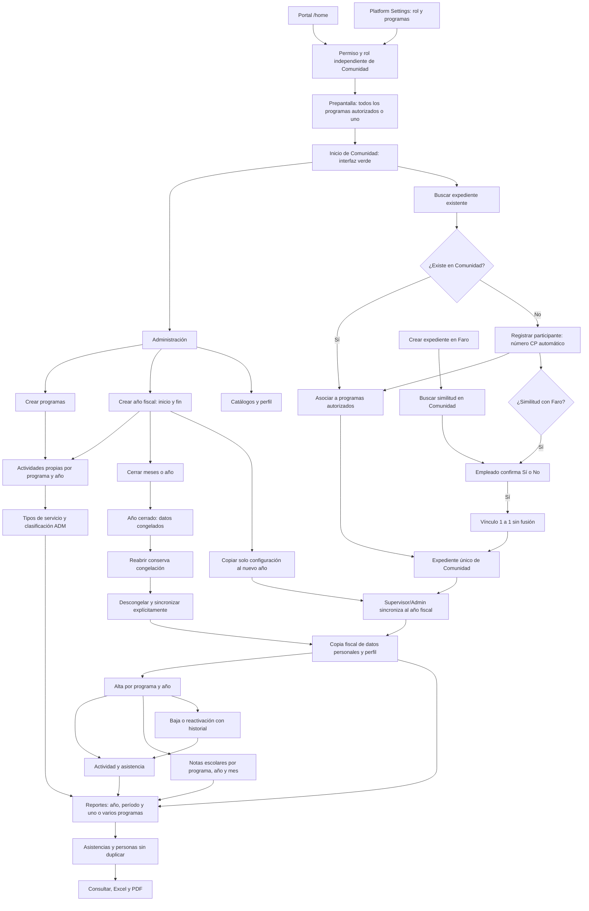

# Comunidad y Prevención: implementación y flowchart

Revisión: 25 de septiembre de 2026.

Primera versión funcional implementada en el código local. No habilitada ni
desplegada en producción. Las pruebas utilizan SQLite temporal y datos ficticios.
Queda pendiente validar migración y concurrencia en SQL Server aislado y revisar
la interfaz en navegador. Este documento no autoriza una puesta en producción.

## Decisiones confirmadas

- Tablas propias `cp_` en la base de la plataforma. Expedientes y operaciones
  independientes de Faro; acceso desde `/home`, identidad verde y menú desplegable.
- Roles independientes: `users.role` permanece como rol Faro; `cp_user_access.role`
  contiene el rol de Comunidad. User tiene uno o varios programas; Viewer consulta;
  Supervisor gestiona operación y sincronización; Admin añade configuración y cierres.
- Un expediente por participante de Comunidad, con número automático
  `CP-2026-0001`. Los registros `CP-2026-VOCA-0001` y `CP-2026-TANF-M-0001`
  comparten año y consecutivo. Se conservan entre años fiscales.
- User puede buscar identidad básica de expedientes de otros programas y asociarlos
  a sus programas. Esa búsqueda no revela contacto, otros programas ni históricos.
- Solo Supervisor/Admin edita datos personales comunes. Dirección física y pueblo
  sustituyen edificio/apartamento. Se incluyen datos demográficos, teléfono, email,
  catálogos y campos adicionales de perfil.
- Años fiscales comunes a todos los programas, con inicio y fin configurables.
  El año del expediente es independiente del fiscal.
- Sincronización explícita crea/actualiza una copia de datos personales y perfil por
  año fiscal. El alta en un programa/año requiere esa copia.
- Cerrar un año congela sus copias. Reabrir conserva congelación y cierres mensuales;
  descongelar y sincronizar requieren acciones explícitas.
- Copiar un año solo copia actividades, tipos de servicio y asociaciones ADM.
  Participantes sincronizados, matrículas, asistencias y notas no se copian.
- Altas, bajas y reactivaciones se gestionan desde el expediente por programa/año,
  con fecha, motivo, observación y empleado. La baja empieza en esa fecha, conserva
  historia y no modifica otros programas. Se bloquean bajas retroactivas incompatibles
  con asistencias o notas ya registradas.
- Notas: grados EE/K/1–12, salón contenido, nueve materias, escala 0–100, promedio y
  letras de Faro. El alta exige edad **actual** de 0–21 años, usando fecha de nacimiento
  de la copia fiscal. Registros guardados permanecen visibles y se pueden corregir
  en períodos abiertos después de cumplir 22.
- Reportes iniciales: Bonafide, no duplicados, participaciones, desglose por programa,
  ADM y notas. Solo cuentan personas con asistencia. La selección multiprograma
  consolida por ID estable; no suma subtotales para calcular personas únicas.
- Coincidencias Faro–Comunidad incluyen escritura aproximada de nombres/apellidos y
  fecha de nacimiento igual. Vínculo confirmado 1:1 por expediente, mediante Sí/No
  humano y auditado. No fusiona ni sincroniza datos de los dos módulos.

## Flowchart actualizado



## Pantallas implementadas

| Área | Ruta | Funcionalidad |
| --- | --- | --- |
| Portal y entrada | `/home`, `/community/login` | Tarjeta y selección de contexto |
| Inicio | `/community` | Resumen de expedientes, distinto del conteo por asistencia |
| Programas | `/community/programs` | Creación; disponibilidad automática en reportes |
| Años fiscales | `/community/fiscal-years` | Crear y copiar configuración |
| Catálogos | `/community/catalogs` | Opciones y perfil, desactivación sin borrar historial |
| Expedientes | `/community/participants` | Lista, alta, búsqueda, asociación, detalle y edición |
| Matrículas | `/community/participants/{id}/memberships` | Altas, bajas, reactivaciones e intervalos |
| Sincronización | `/community/fiscal-participants` | Comparar, sincronizar, congelar y administrar cierres |
| Actividades | `/community/activities` | Crear y asociar actividades a años |
| ADM | `/community/adm` | Servicios y actividades por programa/año |
| Asistencia | `/community/attendance` | Sesiones y registro de asistentes |
| Notas | `/community/school-grades` | Informes mensuales y notas |
| Reportes | `/community/reports` | Seis reportes en pantalla, Excel y PDF |
| Coincidencias CP | `/community/participants/{id}/identity` | Confirmación de identidad Faro |
| Coincidencias Faro | `/ui/new-list/{id}/community-identity` | Confirmación de identidad Comunidad |
| Permisos | `/platform/settings/users/{id}/community` | Administrador de plataforma asigna rol CP y programas |

Las listas de asistencia, notas, expedientes y sincronización tienen paginación.
Las escrituras comprueban rol, alcance y CSRF; las descargas respetan el mismo alcance.

## Persistencia y límites de la versión

- Modelos, servicios, rutas, templates y SQL se separan por área en archivos
  `community*.py`. Los servicios validan y hacen flush; las rutas controlan
  commit/rollback. Expediente, asociaciones y perfil se crean en una transacción.
- Secuencia anual con `UPDLOCK, HOLDLOCK` en SQL Server y restricciones únicas.
  Se detiene en 9999; ampliar el formato necesita una decisión posterior.
- Cambios fiscales se serializan por año. Sincronización bloquea también el
  expediente mientras copia datos personales y perfil.
- Reportes leen copias fiscales. Si falta una copia de alguien con asistencia,
  se informa el error; no se sustituyen datos actuales silenciosamente.
- La edad en desgloses demográficos se calcula al final del período consultado.
  La regla específica de elegibilidad de notas utiliza edad actual.
- ADM conserva la clasificación una vez hay sesiones. Desactivar un tipo conserva
  asociaciones. Actividades sin clasificación aparecen aparte, fuera del total ADM;
  categorías homónimas de programas diferentes no se fusionan.
- Notas exportadas requieren asistencia en programa/período seleccionado. Sus
  métricas se limitan a participantes/programas que tienen notas.
- Cruce: DOB igual y similitud mínima 0.80 en nombre y cada apellido disponible,
  ignorando tildes, mayúsculas y espacios adicionales. Segundo apellido ausente no
  bloquea sugerencias. POST recalcula candidatos; índices filtrados garantizan 1:1.
- No vuelve a ofrecerse un par rechazado. El flujo inicial no deshace decisiones.
  Correcciones de identidades y reportes del conglomerado son ampliaciones futuras.
- La creación web abre revisión de coincidencias. Registros creados por API Faro
  pueden revisarlas posteriormente desde su expediente.

## Verificación local

Repositorio `intranet-app-ui-modernization`, rama `ui/modernization-v1`,
HEAD inicial `6fdd706`. Se preservaron bytecode modificado y PDF ajeno preexistentes.
Las pruebas descritas se realizaron antes de publicar la entrega. No se desplegó
ni conectó a producción.

```text
.venv/Scripts/python.exe -B -m unittest discover -s tests -p 'test_community*.py' -q
.venv/Scripts/python.exe -B -m unittest discover -s tests -q
```

- **115 pruebas de Comunidad aprobadas**, salida 0, después del ajuste final y su
  regresión de paginación PDF (48.072 segundos).
- Suite general: **470 pruebas, una omitida, sin fallos**, salida 0. La omisión es una
  variante preexistente de renderizado PDF; «EOF marker not found» proviene de pruebas
  existentes y no produjo fallos.
- Recorrido integrado mediante rutas reales: registro en dos programas, sincronización,
  altas, ADM, asistencia, notas, reporte consolidado, baja independiente, cierre,
  edición actual, descargas y copia al siguiente año. Verifica números estables,
  histórico congelado y ausencia de operaciones copiadas.
- SQLite con claves foráneas activas: persistencia, cuatro altas concurrentes sin
  duplicar número, intervalos y protección histórica.
- HTTP: roles independientes, alcance, contexto obsoleto, Viewer, CSRF, denegación
  de acceso cruzado y búsqueda limitada a identidad básica.
- Seis reportes leídos con pypdf/openpyxl; Excel conserva texto parecido a fórmulas.
- PDF: ocho páginas de muestras ficticias de los seis reportes renderizadas con
  Poppler e inspeccionadas visualmente, incluyendo 30 filas de notas. Se ajustaron
  columnas, repetición de encabezados y títulos entre páginas. Las tablas de notas
  comienzan en la primera página y mantienen encabezados al continuar.
- Revisión independiente de permisos e identidad sin hallazgos materiales nuevos.
  Se corrigió que retirar la última opción de catálogo habilitara texto libre.

La compilación MSSQL y las pruebas SQLite no demuestran ejecución del DDL ni
concurrencia efectiva en SQL Server. La vista previa web local fue bloqueada por el
navegador integrado (`net::ERR_BLOCKED_BY_CLIENT`); el proceso se detuvo. La revisión
visual de la aplicación web permanece pendiente.

### Corrección de filtros booleanos en SQL Server

La validación en la PC de pruebas detectó un error 500 al crear participantes:
el filtro de programas activos generaba `IS 1`, inválido en SQL Server. Se cambió
a igualdad (`= 1`) ese filtro y los equivalentes de años fiscales, actividades y
asistencias utilizadas para validar bajas. No requiere cambios en las tablas.

La prueba del recorrido integrado ahora compila sus consultas reales con el
dialecto MSSQL y rechaza esos predicados incompatibles. Falló en la consulta de
programas antes de la corrección y pasó después; las **115 pruebas de Comunidad**
pasaron con salida 0 (47.332 segundos). La ejecución en SQL Server de la PC de
pruebas queda pendiente de repetir el registro tras actualizar y reiniciar.

## Entrega y validación en la PC de pruebas

Flujo acordado por el usuario: preparar los cambios, hacer commit y push a
`ui/modernization-v1` y validar el sistema en la **PC de pruebas**. El usuario revisa
allí el comportamiento y solicita los ajustes de la siguiente entrega. Las pruebas
automatizadas locales complementan esa validación; no la sustituyen.

En la copia del repositorio de la PC de pruebas:

```powershell
git fetch origin
git switch ui/modernization-v1
git pull --ff-only origin ui/modernization-v1
.venv\Scripts\python.exe -m pip install -r requirements.txt
```

En el `.env` existente de esa PC, añadir o actualizar:

```dotenv
COMMUNITY_ENABLED=true
```

Conservar el resto de la configuración de esa PC y reiniciar su aplicación con
el procedimiento habitual. Al arrancar se crean las tablas de Comunidad en la
base SQL configurada allí; esa cuenta SQL necesita permisos para crear tablas e índices.
Desde `/platform/settings`, abrir el usuario y configurar acceso a Comunidad y rol
Admin para la configuración inicial. Después crear programas, asignarlos a los User
y completar año fiscal, actividades y ADM. Entrar desde `/home` para validar.

Recorrido inicial sugerido: registrar una persona en VOCA y TANF-M, sincronizarla
al año fiscal, darle alta en ambos, registrar asistencia, consultar un reporte
multiprograma y comprobar un solo participante consolidado. Darla de baja solo en
TANF-M y verificar que conserva VOCA y las asistencias anteriores. Probar también
notas, descargas, cierres/reaperturas y acceso según cada rol.

## Habilitación y alcance

`COMMUNITY_ENABLED=false` sigue como valor predeterminado. Con el flag apagado no
se muestra la tarjeta, las rutas CP no están disponibles y Faro evita consultas CP.

En un SQL Server de pruebas autorizado, habilitarlo hace que el arranque ejecute DDL
aditivo e idempotente en orden: base, catálogos, actividades, fiscal, operaciones e
identidad. No concede permisos automáticamente. Administrar acceso desde Platform
Settings después de validar la migración.

Antes de producción: validar ese DDL y concurrencia en SQL Server aislado y revisar
la interfaz con los usuarios. Deshabilitar el flag oculta el módulo sin borrar sus datos.
