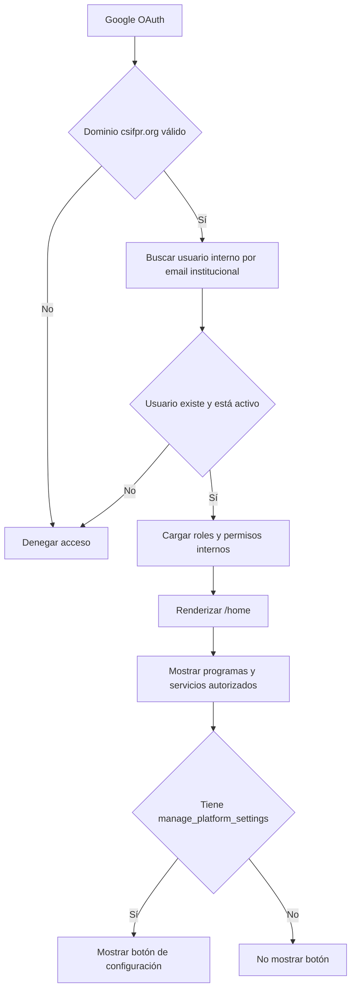

# Roadmap arquitectónico del portal de plataforma

## Propósito

Este documento define la evolución conceptual de `/home` desde un portal institucional público hacia el centro autenticado de la plataforma. También registra la decisión de diferir el botón de configuración hasta que exista un contexto confiable de identidad y permisos.

Este documento es un roadmap. No describe funcionalidad disponible ni autoriza cambios parciales de autenticación, permisos o interfaz.

## Estado de la decisión

- **Estado:** aprobado conceptualmente y diferido para una fase futura.
- **Alcance actual:** documentación solamente.
- **Condición para implementar:** `/home` debe recibir una identidad autenticada mediante Google OAuth o una sesión de plataforma y debe poder cargar permisos internos confiables.

## 1. Estado actual de `/home`

- `/` redirige a `/home`.
- `/home` funciona como portal institucional público.
- La tarjeta activa **Faro de Esperanza** dirige a `/login`.
- Las tarjetas futuras muestran el estado **Próximamente**.
- `/home` no depende todavía de una sesión ni de permisos de usuario.
- `/home` no muestra un botón de configuración.

La implementación actual se considera correcta para esta etapa y no debe incorporar controles administrativos que aparenten una autorización inexistente.

## 2. Estado futuro de `/home`

En una etapa futura, Google OAuth ocurrirá antes de entrar a `/home`. El portal dejará de ser solamente una página pública y se convertirá en el centro principal de acceso a programas y servicios de la plataforma.

El flujo de identidad y autorización tendrá responsabilidades separadas:

- **Google confirma la identidad** del usuario y entrega su email institucional.
- **La intranet vincula esa identidad** con un usuario interno existente.
- **La intranet verifica el estado del usuario y carga sus permisos internos.**
- **La intranet decide los accesos.** Google no administrará roles, permisos ni programas autorizados.
- `/home` mostrará solamente los programas y servicios que el usuario tenga autorizados.

El email institucional será el mecanismo inicial de vinculación. A largo plazo, la identidad también debe guardar `google_sub`, porque es el identificador estable que Google asigna a la cuenta y no depende de cambios futuros en el email.

## 3. Botón futuro de configuración del portal

Cuando `/home` tenga un contexto autenticado y permisos internos confiables, se podrá agregar un botón pequeño de configuración con estas características:

- **Ubicación:** esquina inferior derecha del portal.
- **Presentación:** discreta, institucional y consistente con la identidad visual de `/home`.
- **Ícono sugerido:** engranaje de Bootstrap Icons.
- **Accesibilidad:** operable por teclado, con foco visible y semántica de botón o enlace según su acción final.
- **Etiqueta accesible sugerida:** `aria-label="Configuración del portal"`.
- **Visibilidad:** oculto para usuarios regulares.
- **Autorización:** visible solamente para usuarios con un permiso administrativo específico.
- **Permiso recomendado:** `manage_platform_settings`.

Inicialmente, el permiso podrá asignarse a la cuenta administrativa de Christian. La regla de autorización no debe depender solamente de un email específico. El acceso debe resolverse mediante permisos internos para que pueda delegarse, auditarse y mantenerse sin modificar código.

Ocultar el botón en la interfaz no sustituye la autorización del servidor. La futura zona de configuración también deberá validar `manage_platform_settings` en cada operación protegida.

## 4. Función futura del botón

El botón dará acceso a una zona administrativa de configuración del portal. Esa zona podrá administrar:

- programas visibles en el portal;
- servicios disponibles;
- accesos por usuario;
- permisos por programa;
- posibles tarjetas futuras;
- configuración institucional del portal.

El alcance detallado, las rutas y el modelo de datos se definirán en la fase de implementación. Este roadmap no reserva todavía una URL ni prescribe cambios de base de datos.

## 5. Razón para no implementarlo ahora

El botón no debe implementarse en la etapa actual por las siguientes razones:

- `/home` es público.
- `/home` todavía no tiene un contexto confiable de usuario autenticado.
- La página no puede determinar de forma segura si quien la visita es Christian o una persona autorizada.
- Ocultar el botón mediante un email fijo o una lógica parcial sería prematuro y frágil.
- Crear un permiso sin un flujo real de autenticación y autorización introduciría una garantía falsa de seguridad.
- La implementación debe esperar a que exista Google OAuth o una sesión de plataforma capaz de vincular identidad, usuario interno y permisos.

Esta decisión evita permisos ficticios, lógica incompleta y controles administrativos que solo estén protegidos visualmente.

## 6. Flujo futuro sugerido

Flujo textual equivalente:

`Google OAuth → validar dominio institucional → buscar usuario interno → verificar usuario activo → cargar permisos → renderizar /home → mostrar programas autorizados → si tiene manage_platform_settings, mostrar botón de configuración`.

## 7. Reglas acordadas para Google OAuth

- El dominio institucional autorizado será `csifpr.org`.
- Los usuarios que no existan previamente en la intranet no podrán entrar.
- No habrá auto-registro desde Google OAuth.
- `cramirez` administrará internamente los roles y permisos.
- El login local se mantendrá temporalmente durante la transición.
- El usuario local `admin` se mantendrá como cuenta de seguridad y recuperación.
- Google OAuth usará el email institucional para vincular el usuario interno.
- En una evolución posterior, la vinculación también deberá guardar `google_sub` como identificador estable de Google.

## 8. Límites de esta fase

Esta fase no incluye:

- agregar el botón visible;
- crear rutas de configuración;
- crear permisos;
- modificar login, logout o sesiones;
- implementar Google OAuth;
- modificar modelos, base de datos o migraciones;
- modificar programas, reportes o reglas de negocio existentes.

Antes de iniciar la implementación futura, se deberá diseñar y revisar conjuntamente el flujo de autenticación, la vinculación de identidades, la resolución de permisos y la protección del lado del servidor.
